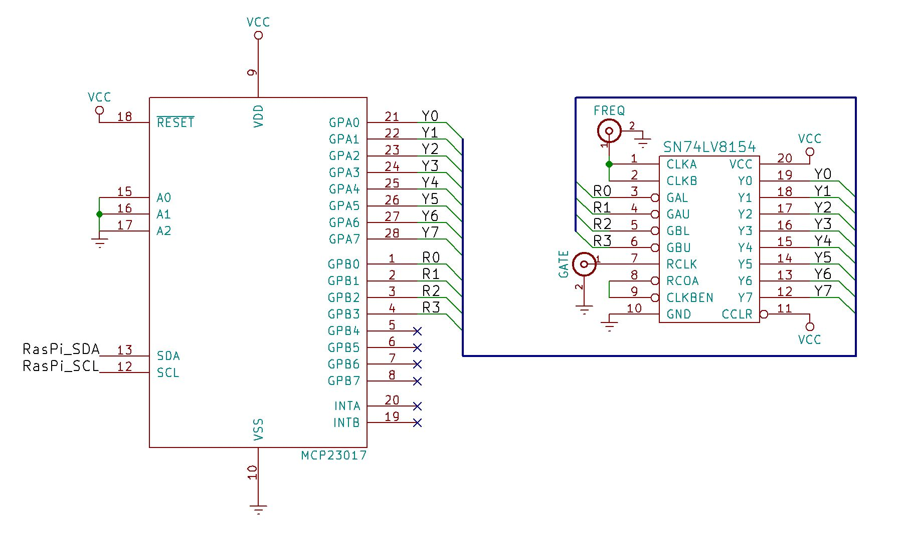
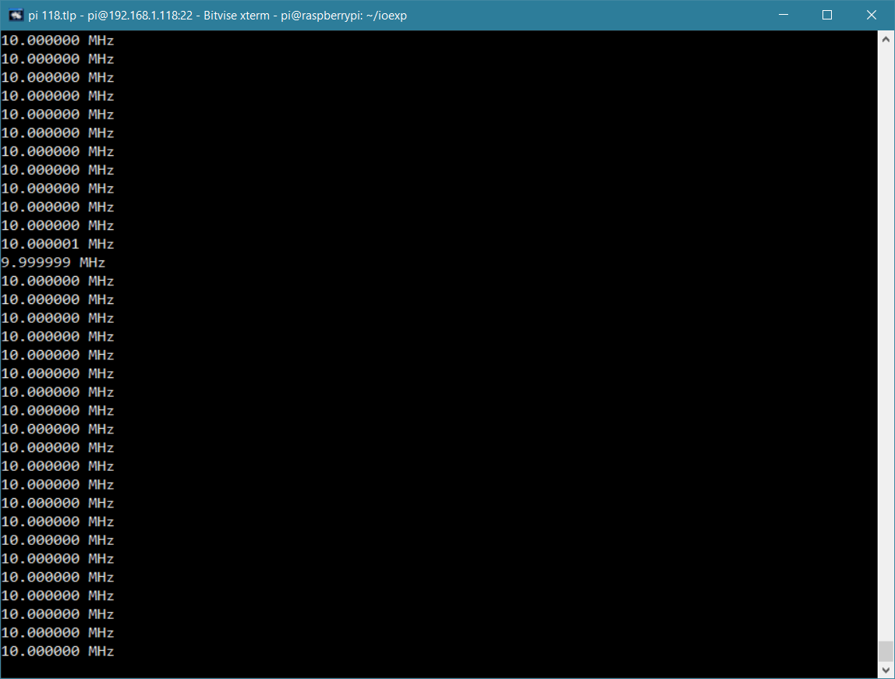

# RasPi-Frequency-Counter
Raspberry PI RF Frequency Counter with Python Interface. The RF signal clocks a 32-bit counter (SN74LV8154) connected to a 16-bit IO expander (MCP23017) accessable to the Raspberry Pi (via I²C) to provide real-time frequency measurements from a python script.

Project Page: http://www.swharden.com/wp/2016-10-10-raspberry-pi-rf-frequency-counter/

